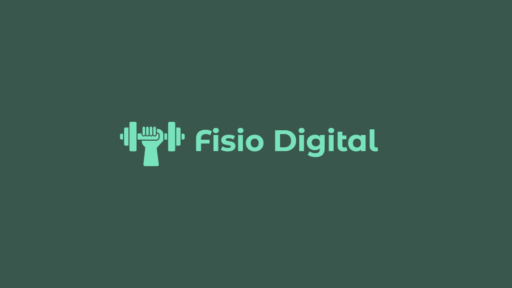

# Fisio-Digital

Aplicação web de fisioterapia para auxiliar na marcação de consultas e atualização de fichas de avaliação, criada com o objetivo de facilitar as avaliações no Centro de Práticas da Uniceplac, este site promete agilizar os atendimentos, dar um fim em fichas fisicas preenchidas manualmente e facilitar cada vez mais o trabalho dos fisioterapeutas. 

## Justificativa e Necessidade de Negócio

Uma análise criteriosa do fluxo de atendimentos de fisioterapia no Centro de Práticas da Uniceplac identificou dificuldades significativos no processo atual. O sistema que eles possuem atualmente, baseado integralmente em registros manuais em papel, resulta em ineficiências operacionais, como atrasos na recuperação de informações, retrabalho para preenchimento e consolidação de dados, e risco de perda de informações críticas. Essa metodologia compromete a agilidade e a qualidade dos atendimentos, além de limitar o conforto e a produtividade dos fisioterapeutas envolvidos. A digitalização e automação são essenciais para modernizar o serviço, garantir a integridade dos dados e otimizar a experiência de alunos, professores e pacientes.

# Descrição do Escopo do Produto

Desenvolver e implantar uma plataforma web centralizada para a gestão completa dos atendimentos de fisioterapia, desde o agendamento de consultas até o acompanhamento contínuo da evolução do paciente, garantindo segurança, acessibilidade e eficiência.

### Objetivos Específicos

- **Otimizar o Agendamento:** Implementar um sistema de agendamento online intuitivo para pacientes e fisioterapeutas.  
- **Centralizar a Documentação do Paciente:** Criar um prontuário eletrônico seguro para upload, armazenamento e atualização de laudos e fichas de acompanhamento.  
- **Melhorar a Comunicação e Adesão:** Integrar um sistema de notificações para lembrar pacientes e fisioterapeutas sobre os compromissos, visando reduzir a taxa de faltas.  
- **Aprimorar a Experiência do Usuário (UX):** Desenvolver uma interface clara, intuitiva e responsiva, com perfis de acesso distintos para fisioterapeutas e pacientes.  

### Principais Entregáveis 

- **Plataforma Web Funcional:** Incluindo os seguintes módulos:  
  - **Módulo de Agendamento:** Calendário interativo para marcação, consulta e cancelamento de horários.  
  - **Módulo de Gestão de Pacientes:** Sistema para cadastro de pacientes e gestão de prontuários eletrônicos (laudos, fichas de avaliação e evolução).  
  - **Módulo de Notificações:** Sistema de envio de e-mails e/ou notificações push.  

- **Interfaces de Usuário (UI):**  
  - **Painel do Fisioterapeuta:** Com visualização da agenda, acesso aos prontuários dos pacientes, ferramentas para edição de fichas e dashboard de acompanhamento.  
  - **Portal do Paciente:** Com funcionalidades para agendar consultas, visualizar horários marcados e acessar seu histórico.  

- **Documentação do Projeto:** Manual de usuário para ambos os perfis e documentação técnica do sistema.

### Especificações Técnicas

- **Backend:** PHP  
- **Frontend:** HTML5, CSS3, JavaScript  
- **Banco de Dados:** MySQL  
- **Segurança:** Implementação de criptografia para dados sensíveis e total conformidade com a Lei Geral de Proteção de Dados (LGPD).  
- **Arquitetura:** Níveis de acesso baseados em perfil de usuário.

## Distribuição da Plataforma e Assistência ao Usuário

### Distribuição da Plataforma

A plataforma web será hospedada em um ambiente de nuvem confiável, garantindo alta disponibilidade, escalabilidade e segurança. O sistema estará acessível por meio de navegadores modernos, sem a necessidade de instalação local, permitindo o uso em desktops, tablets e smartphones.

#### Principais características da distribuição:

- **Hospedagem em Nuvem:** Utilização de serviços como AWS, Azure ou DigitalOcean para garantir estabilidade e redundância.
- **Disponibilidade Contínua:** A plataforma será operante 24 horas por dia, 7 dias por semana.
- **Atualizações Automatizadas:** Melhorias e correções serão aplicadas diretamente no ambiente de produção, minimizando a necessidade de intervenção do usuário.
- **Backup Regular:** Rotinas de backup diárias garantirão a segurança e recuperação dos dados em caso de falhas.

### Assistência ao Usuário

Para garantir uma experiência de uso eficiente e sem interrupções, será oferecido suporte técnico aos usuários da plataforma, com diferentes canais de atendimento e materiais de apoio.

#### Formas de Suporte:

- **Central de Ajuda Online:** Base de conhecimento com artigos, tutoriais e perguntas frequentes.
- **Atendimento via E-mail:** Canal dedicado para dúvidas técnicas, sugestões e relatos de problemas.
- **Documentação do Usuário:** Manual completo em formato digital, segmentado por perfis de acesso (paciente e fisioterapeuta), com instruções claras de uso.

# Instruções de Entrega e Distribuição da Plataforma

## Itens Entregues

A entrega da plataforma será composta por diversos itens que garantem sua execução funcional e uso eficaz:

- **Programas Executáveis:**  
  Versão final do sistema desenvolvida em PHP (backend), com HTML5, CSS3 e JavaScript (frontend), e banco de dados MySQL.

- **Scripts de Instalação:**  
  Scripts para deploy automatizado em ambiente de produção (Linux + Apache/Nginx), configuração de banco de dados e permissões de acesso.

- **Documentação do Usuário:**  
  - Manual do Paciente  
  - Manual do Fisioterapeuta  
  - Manual Técnico do Administrador

## Empacotamento do Software

O produto final será empacotado com os seguintes componentes:

- **Repositório de Código-Fonte:**  
  Entregue via GitHub (privado), com estrutura organizada por módulos e tags de versão.

- **Build Final em ZIP:**  
  Pacote contendo:  
  - Código-fonte da aplicação  
  - Scripts de instalação  
  - Arquivos de configuração padrão  
  - Pastas separadas para cada tipo de documentação (PDF, Markdown)

- **Vídeos Explicativos:**  
  Dois vídeos curtos (.mp4) demonstrando o uso dos principais módulos (agendamento e prontuário).

## Distribuição do Software

A distribuição será feita por meio dos seguintes canais:

- **Entrega Local:**  
  Upload para servidor do Centro de Práticas da Uniceplac (on-premise) ou hospedagem em Nuvem (AWS/Azure).

- **Distribuição via Internet (Git):**  
  Caso a hospedagem fique sob responsabilidade do cliente, será disponibilizado o repositório com instruções detalhadas.

- **Controle de Acesso e Licenciamento:**  
  - Sistema protegido por autenticação com senhas criptografadas  
  - Controle de permissões por perfil de usuário  
  - Licenciamento interno limitado ao Centro de Práticas da Uniceplac, sem redistribuição

## Instalação do Software

### Pré-requisitos Técnicos

- Servidor Linux com PHP 8+, MySQL 5.7+, Apache/Nginx  
- Acesso SSH e FTP

### Procedimentos

- Upload dos arquivos empacotados  
- Execução do script de instalação  
- Configuração do banco de dados  
- Teste funcional de todos os módulos

**Responsabilidade:**  
O time técnico do projeto realizará a primeira instalação. Futuras instalações seguirão a documentação entregue.

## Migração

### Substituição de Sistema Antigo

- O sistema anterior (fichas preenchidas no papel) será descontinuado para os novos atendimentos.  
- Os dados antigos não serão migrados.

### Preparação para Migração Futura

- O sistema contará com estrutura modular para integração de APIs externas.  
- Caso deseje-se, futuramente, digitalizar fichas antigas, o sistema irá permitir upload de PDFs nos prontuários.

## Auxílio e Suporte ao Usuário

### Treinamento Formal

- Sessões presenciais de capacitação 

### Documentação de Apoio

- Manuais do usuário e vídeos curtos com instruções de uso  
- FAQ e guia de primeiros passos impressos

### Suporte Técnico

- Canal de e-mail institucional para dúvidas  
- Atendimento remoto agendado para problemas técnicos

# EAP (Estrutura Analítica do Projeto)

## Planejamento

### Levantamento de Requisitos
- **Reuniões com stakeholders**
- **Documentação dos requisitos**

### Modelagem Inicial
- **Criação de wireframes**
- **Aprovação de protótipos**

## Desenvolvimento

### Backend
- **Cadastro e login de usuários**
- **Agendamento de atendimentos**
- **Prontuário eletrônico**

### Frontend
- **Telas responsivas**
- **Integração com backend**

## Testes
- **Teste por módulo e Avaliação com fisioterapeutas**

## Opinião Especializada
Algumas atividades do projeto requerem a participação direta de especialistas para garantir conformidade, qualidade e segurança na entrega da plataforma.

### Avaliação com Fisioterapeutas

Serão realizados testes práticos com fisioterapeutas do Centro de Práticas da Uniceplac, com o objetivo de validar a **usabilidade da interface**, identificar pontos de melhoria na navegação e assegurar que o fluxo de uso esteja alinhado às rotinas clínicas reais.

### Consultoria em LGPD e Sistemas de Saúde 

A funcionalidade da **ficha de avaliação** envolve requisitos legais e questões de segurança da informação. Será necessária a **consulta com um especialista em LGPD (Lei Geral de Proteção de Dados)** e sistemas voltados à área da saúde, a fim de garantir que:

- Os dados do paciente estejam devidamente protegidos.
- O sistema respeite as normas vigentes de sigilo médico.
- A arquitetura atenda aos padrões de conformidade exigidos para soluções digitais de saúde.

# Estimativa da Execução das Tarefas

A seguir, apresentamos a estimativa de execução das tarefas do projeto **Fisio Digital**, conforme os critérios de avaliação por dados históricos, medida do trabalho e complexidade.

| Tarefa / Pacote de Trabalho           | Dados Históricos                              | Medida do Trabalho                  | Complexidade | Estimativa de Esforço (dias) |
|--------------------------------------|------------------------------------------------|------------------------------------|--------------|-------------------------------|
| Levantamento de Requisitos           | Projetos similares usaram entrevistas          | 5 reuniões com stakeholders        | Média        | 4                             |
| Modelagem Inicial (Wireframes + Aprovação) | Baseado em protótipos anteriores              | 6 telas principais                 | Baixa        | 3                             |
| Definição de Tecnologias             | Reutilização de stack comum (Bootstrap, PHP)   | 3 tecnologias principais           | Baixa        | 2                             |
| Cadastro/Login de Usuários           | Módulo reaproveitado de outro sistema          | ~400 linhas de código             | Média        | 5                             |
| Agendamento de Atendimentos          | Projeto semelhante em clínica escolar          | 3 interfaces + 6 regras de negócio | Alta         | 8                             |
| Prontuário Eletrônico                | Nova funcionalidade adaptada de pesquisa       | 5 formulários + CRUD complexo      | Alta         | 10                            |
| Telas Responsivas                    | Uso de Bootstrap 5.3                           | 8 telas principais                 | Média        | 5                             |
| Testes de Funcionalidade             | Utilização de plano de testes base             | 10 casos de teste                 | Média        | 4                             |
| Testes de Usabilidade                | Entrevistas com 2 fisioterapeutas              | 2 sessões de testes                | Baixa        | 2                             |
| Geração do Pacote Final              | Experiência prévia em empacotamento web        | 1 build + testes                   | Baixa        | 1                             |
| Deploy no servidor Uniceplac         | Baseado em projeto anterior do campus          | 1 ambiente                         | Média        | 2                             |
| Treinamento e Manuais                | Manual baseado em sistema anterior             | 1 manual + 2 sessões               | Baixa        | 3                             |
| Suporte Técnico Inicial              | Atendimento remoto                             | Até 10 chamados                    | Média        | 5                             |

### Observações

As estimativas foram construídas com base na experiência em projetos similares, considerando a complexidade, o volume de trabalho e os recursos disponíveis.  
A margem de erro pode variar conforme fatores inesperados durante a fase de planejamento.

# Identificar e Documentar Recursos
Esse documento tem como finalidade identificar e documentar os recursos necessários para o desenvolvimento e implantação do sistema, incluindo equipe técnica, infraestrutura de TI e suporte.

## Relacionamentos
- **Funções:**
  - Gerente do Projeto
  - Líder Técnico
- **Entradas:**
  - Declaração de Trabalho (obrigatória)
- **Saídas:**
  - Recursos

## Descrição Principal
Os requisitos de recursos abrangem os elementos necessários para cada fase do projeto. Incluem equipe especializada, infraestrutura de desenvolvimento, ferramentas e ambientes de teste e produção.

## Estrutura de Recursos

### Mão de Obra
- Desenvolvedor Backend (PHP)
- Desenvolvedor Frontend (HTML/CSS/JS)
- Designer UX/UI
- Analista de Requisitos
- Testador (QA)
- Gerente de Projeto

### Equipamentos
- Computadores com ambiente de desenvolvimento
- Servidor de testes (local ou em nuvem)
- Servidor de produção (hospedagem ou instância em nuvem)

### Softwares e Ferramentas
- IDE (VSCode)
- Figma (para design de interface)
- Git/GitHub (para versionamento)
- MySQL Workbench
- Navegadores para testes (Chrome, Firefox)

### Ambientes
- Ambiente de Desenvolvimento (local)
- Ambiente de Homologação/Testes
- Ambiente de Produção

### Suporte e Treinamento
- Sessões de capacitação para usuários finais
- Documentação técnica e manuais
- Canal de suporte por e-mail

# Equipe do Trabalho

## Lista de Atividades do Projeto

Com base na Estrutura Analítica do Projeto (EAP), foram identificadas as seguintes atividades:

### Planejamento
- Levantamento de Requisitos
- Definição do Escopo
- Elaboração do Cronograma

### Análise e Projeto
- Modelagem de Dados (MER e DER)
- Definição da Arquitetura do Sistema
- Protótipos de Telas (Wireframes)

### Implementação
- Desenvolvimento do Front-end (Bootstrap 5.3, HTML, CSS, JavaScript)
- Desenvolvimento do Back-end (PHP, Banco de Dados MySQL)
- Integração das Funcionalidades

### Testes e Validação
- Testes de Unidade
- Testes de Integração
- Testes com Usuários

### Entrega e Documentação
- Documentação Técnica
- Manual do Usuário
- Apresentação Final

## Implicações da Atribuição de Tarefas

### Papéis e Responsabilidades

| Integrante                 | Papéis Principais                                            | Atividades Envolvidas                                    | Forma de Trabalho                 |
|---------------------------|--------------------------------------------------------------|----------------------------------------------------------|-----------------------------------|
| **Kennedy Marques**       | Gerente de Projeto, Programador Full-Stack, Product Owner, modelagem de dados   | Planejamento, Front-end, Back-end, Requisitos, MER, MySql, Documentação | Liderança e trabalho colaborativo |
| **Laysa Bittencourt**     | Designer de Interface, Programadora Full-Stack, Testadora    | Protótipos, Front-end, Testes, Back-end                  | Design e desenvolvimento integrado|
| **Eduardo**               | Programador Full-Stack, Analista de Requisitos               | Back-end, Front-end, Análise de dados e processos        | Apoio técnico e levantamento      |

---

## Considerações Finais

A equipe foi definida com base nas competências técnicas e na experiência de cada membro, buscando atender às exigências do projeto com eficiência. As atribuições respeitam a carga horária, a disponibilidade e o foco de atuação de cada integrante, promovendo sinergia entre as etapas de desenvolvimento.

# Estimativa de inicio e término das tarefas
As seguintes datas intermediárias e finais foram definidas para o projeto:

- **Início do Projeto:** 17/06/2025  
- **Conclusão do Levantamento de Requisitos:** até 15/07/2025  
- **Conclusão do Desenvolvimento:** até 30/09/2025  
- **Finalização dos Testes:** até 09/10/2025  
- **Apresentação Final:** 17/10/2025

# Estimativas de Esforço e Custo

Apresenta-se, a seguir, a estimativa de esforço e custos para a execução do projeto Fisio Digital.

---

## Recursos Humanos

| **Função**                   | **Qtd. de Pessoas** | **Tempo Estimado** | **Valor Mensal (R\$)** | **Custo Total (R\$)** |
| ---------------------------- | ------------------- | ------------------ | ---------------------- | --------------------- |
| Gerente de Projeto           | 1                   | 4 meses            | 10.000,00              | 40.000,00             |
| Desenvolvedor Full Stack     | 2                   | 4 meses            | 12.000,00              | 96.000,00             |
| Designer UI/UX               | 1                   | 2 meses            | 8.000,00               | 16.000,00             |
| Analista de QA (Testes)      | 1                   | 2 meses            | 7.000,00               | 14.000,00             |
| Suporte Técnico/Documentação | 1                   | 1 mês              | 6.000,00               | 6.000,00              |
| **Subtotal**                 | —                   | —                  | —                      | **R\$ 172.000,00**    |

---

## Infraestrutura e Tecnologia

| **Item**                         | **Custo Estimado Mensal (R\$)** | **Período** | **Custo Total (R\$)** |
| -------------------------------- | ------------------------------- | ----------- | --------------------- |
| Servidor em nuvem (AWS/Azure)    | 600,00                          | 4 meses     | 2.400,00              |
| Armazenamento seguro de arquivos | 300,00                          | 4 meses     | 1.200,00              |
| Ferramentas de desenvolvimento   | 500,00                          | 4 meses     | 2.000,00              |
| Licenças de software (UI/Testes) | 400,00                          | 2 meses     | 800,00                |
| **Subtotal**                     | —                               | —           | **R\$ 6.400,00**      |

---

## Comunicação, Treinamentos e Documentação

| **Item**                        | **Custo Estimado (R\$)** |
| ------------------------------- | ------------------------ |
| Material para treinamento       | 2.000,00                 |
| Produção de manuais/guias       | 1.500,00                 |
| Ferramentas de videoconferência | 500,00                   |
| **Subtotal**                    | **R\$ 4.000,00**         |

---

## Contingência (10% do valor total estimado)

| **Item**        | **Valor (R\$)** |
| --------------- | --------------- |
| Reserva Técnica | 18.600,00       |

---

## Custo Total Estimado do Projeto: R\$ 201.000,00

# Identificação e Documentação de Riscos

Esta seção apresenta os principais riscos associados ao desenvolvimento da Fisio Digital

| **Risco**                                | **Descrição**                                                                                           | **Probabilidade** | **Impacto** | **Plano de Resposta**                                                                                               | **Responsável**     |
| ---------------------------------------- | ------------------------------------------------------------------------------------------------------- | ----------------- | ----------- | ------------------------------------------------------------------------------------------------------------------- | ------------------- |
| **Atraso na entrega de funcionalidades** | A equipe de desenvolvimento pode não cumprir os prazos devido à complexidade técnica envolvida.         | Média             | Alto        | Realizar reuniões semanais de acompanhamento; priorizar o backlog; aplicar metodologias ágeis.                      | Gerente de Projeto  |
| **Rejeição por parte dos usuários**      | Profissionais ou pacientes podem resistir à adoção do sistema digital, preferindo métodos tradicionais. | Média             | Alto        | Promover treinamentos e campanhas de sensibilização; envolver usuários em testes e validação da interface.          | Designer / PM       |
| **Falhas de segurança e LGPD**           | Dados sensíveis podem vazar devido a falhas de criptografia ou acessos indevidos.                       | Baixa             | Alto        | Implementar boas práticas de segurança; realizar testes de vulnerabilidade.                                         | Dev Full Stack / QA |
| **Indisponibilidade da infraestrutura**  | Problemas no servidor podem afetar o agendamento ou o acesso às fichas dos pacientes.                   | Média             | Médio       | Monitorar o servidor; utilizar serviços em nuvem com alta disponibilidade e backups automáticos.                    | DevOps              |
| **Escopo mal definido**                  | Mudanças frequentes nas funcionalidades esperadas podem comprometer a execução do projeto.              | Alta              | Alto        | Congelar o escopo após o levantamento; validar e documentar com os stakeholders antes do início do desenvolvimento. | Gerente de Projeto  |
